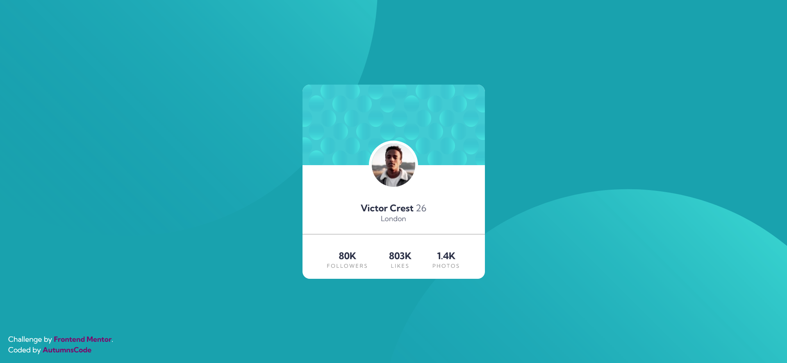

# Frontend Mentor - Profile card component solution

This is a solution to the [Profile card component challenge on Frontend Mentor](https://www.frontendmentor.io/challenges/profile-card-component-cfArpWshJ). Frontend Mentor challenges help you improve your coding skills by building realistic projects. 

## Table of contents

- [Overview](#overview)
  - [The challenge](#the-challenge)
  - [Screenshot](#screenshot)
  - [Links](#links)
- [My process](#my-process)
  - [Built with](#built-with)
  - [What I learned](#what-i-learned)
  - [Continued development](#continued-development)
  - [Useful resources](#useful-resources)
- [Author](#author)

## Overview

### The challenge

- Build out the project to the designs provided

### Screenshot

### Links

- Solution URL: [Solution](https://github.com/AutumnsCode/fem/tree/main/newbie/profile-card-component)
- Live Site URL: [live Site](https://dulcet-torrone-a1de7d.netlify.app/)

## My process

### Built with

- Semantic HTML5 markup
- CSS custom properties
- Flexbox
- CSS Grid
- Mobile-first workflow

### What I learned
The most difficult thing here had been the background image on the body as it was try and error.

### Continued development

Working on my html5 skill

### Useful resources

- [fedmentor](https://fedmentor.dev/posts/html-plan-product-preview/) - This helped me for the HTML5 part as the perfect guide

## Author

- Frontend Mentor - [@AutumnsCode](https://www.frontendmentor.io/profile/AutumnsCode)

